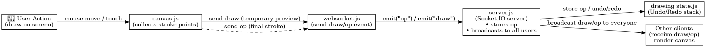

# 🏗️ ARCHITECTURE.md — Collaborative Real-Time Drawing Canvas

This document explains how real-time drawing works, how messages are sent using WebSockets, how undo/redo is handled globally, why certain optimizations were chosen, and how simultaneous drawing conflicts are resolved.

---

##  Data Flow Diagram — How Drawing Events Flow

The diagram below shows how a user action becomes a canvas update for everyone:

---

### 🔍 Explanation (Flow Summary)

| Step | Component | What happens |
|------|-----------|--------------|
| 1 | **User** | Draws using mouse/touch on canvas |
| 2 | **canvas.js** | Captures stroke points as the user draws |
| 3 | **websocket.js** | Sends real-time updates (`draw`) and finalized operations (`op`) |
| 4 | **server.js (Socket.IO)** | Saves and broadcasts operations to all connected users |
| 5 | **drawing-state.js** | Manages shared history + undo/redo logic |
| 6 | **Clients** | Receive operations & redraw strokes consistently |

---

##  WebSocket Protocol — Messages Sent & Received

The app uses **Socket.IO** to keep all users synchronized.

| Event | Direction | Payload | Purpose |
|--------|----------|----------|---------|
| `draw` | Client ➜ Server ➜ Other Clients | `{ tool, color, width, points, temp: true }` | Temporary preview while drawing (not stored). |
| `op` | Client ➜ Server ➜ All Clients | `{ tool, color, width, startX, startY, endX, endY, active: true }` | Final operation saved into shared canvas history. |
| `undo` / `redo` | Client ➜ Server ➜ All Clients | *(no payload)* | Server updates history and broadcasts latest state. |
| `history` | Server ➜ Client | `[ {op1}, {op2}, ... ]` | Sends active operations to new users. |
| `pointer` | Client ➜ Server ➜ Other Clients | `{ clientId, username, color, x, y }` | Real-time cursor sharing. |
| `userList` | Server ➜ All Clients | `[ {id, username, color} ]` | Keeps UI updated with active users. |
| `removeCursor` | Server ➜ All Clients | `{ clientId }` | Removes cursor when user disconnects. |

> `draw` = preview  
> `op` = final committed stroke stored by server

---

##  Undo/Redo Strategy — Handling Global Operations

The server maintains a **shared global history** of canvas actions using two arrays:

ops[] → active and inactive operations (full history)
undoneStack[] → temporarily removed operations (used for redo)

How undo works:
1. Server finds the **latest active** operation.
2. Marks it as `active = false`, pushes it into `undoneStack`.
3. Sends updated `history` to all clients → all canvases update the same way.

How redo works:
1. Server restores the last operation from `undoneStack`.
2. Marks it active again and broadcasts updated `history`.

Because undo/redo is controlled **only by the server**, the canvas remains consistent for all users.

> Undo/Redo is **not per-user**, it affects the shared canvas for everyone.

---

##  Performance Decisions — Why These Optimizations Were Chosen

To keep collaboration smooth and low-latency:

- **Only small preview segments are sent while drawing** (`draw` events).
- **Only one final operation is stored per stroke** (`op` event).
- Canvas is redrawn **only when needed** (undo/redo or history update).
- Server stores **operations**, not screenshots — allows efficient canvas rebuild.
- Cursor updates (`pointer`) are sent **separately** to avoid clogging drawing events.

These decisions reduce WebSocket payload size, CPU usage, and keep rendering fast even when multiple users draw simultaneously.

---

##  Conflict Resolution — Handling Simultaneous Drawing

There is **no canvas locking**. Users can draw at the same time.

- Each drawing action becomes a separate operation.
- Server processes operations FIFO (first in, first out).
- Every operation gets a unique ID and is added to global history.
- Undo always removes the **latest global operation**, not the latest user action.

This ensures:
- No race conditions
- No overwriting of strokes
- Consistent canvas for every user

> Simultaneous drawing becomes a list of ordered operations — not a conflict.

---

### Summary

| Feature | How it's handled |
|---------|------------------|
| Real-time drawing | WebSockets (`draw` + `op`) |
| Global undo/redo | Server maintains `ops[]` + `undoneStack[]` |
| Multi-user sync | Server broadcasts operations to all clients |
| No conflicts | Server orders operations FIFO + UUIDs |
| Performance | Only diffs sent, minimal rendering, lightweight ops |

---

